# Morphology

Reference: [Robert Fisher, Simon Perkins, Ashley Walker, Erik Wolfart (Image Processing Learning Resource)](https://homepages.inf.ed.ac.uk/rbf/HIPR2/)

## Load Necessary Library


```python
import cv2 as cv
import matplotlib.pyplot as plt
import numpy as np
```

## Preparation

### Convert Color Space RGB to Grayscale


```python
img = cv.imread("sample.jpg")
img = cv.cvtColor(img, cv.COLOR_BGR2GRAY)
plt.figure(figsize=(4,4))
plt.imshow(img, cmap='gray')
```


    <matplotlib.image.AxesImage at 0x11f4c6dd0>


    
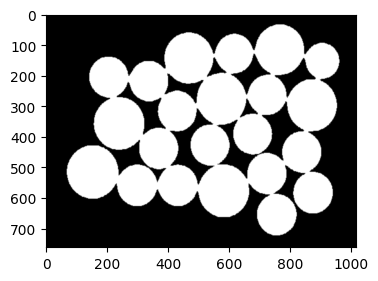
    


### Thresholding


```python
img[img<10] = 0
img[img>=10] = 255

plt.figure(figsize=(4,4))
plt.imshow(img, cmap='gray')
```


    <matplotlib.image.AxesImage at 0x11f47b190>


    
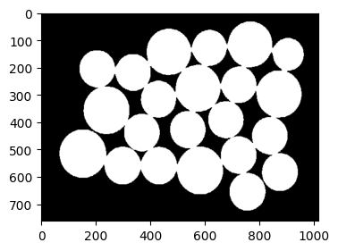
    


### Make Border For Convolution Process

Gambar masukan berdimensi 4x6
|1|1|1|1|1|1|
|-|-|-|-|-|-|
|1|1|1|1|1|1|
|1|1|1|1|1|1|
|1|1|1|1|1|1|

ditambahkan border sebanyak 1 pixel di atas, bawah, kiri, kanan gambar, sehingga dimensinya menjadi 6x8

|0|0|0|0|0|0|0|0|
|-|-|-|-|-|-|-|-|
|0|1|1|1|1|1|1|0|
|0|1|1|1|1|1|1|0|
|0|1|1|1|1|1|1|0|
|0|1|1|1|1|1|1|0|
|0|0|0|0|0|0|0|0|

Jika konvolusi dilakukan menggunakan Structuring Element (SE) berdimensi 3x3, maka posisi titik tengah kernel pada proses konvolusi pertama kali pada tanda X 

Konvolusi ke-1

|x|x|x|0|0|0|0|0|
|-|-|-|-|-|-|-|-|
|x|x|x|1|1|1|1|0|
|x|x|x|1|1|1|1|0|
|0|1|1|1|1|1|1|0|
|0|1|1|1|1|1|1|0|
|0|0|0|0|0|0|0|0|

Konvolusi ke-2

|0|x|x|x|0|0|0|0|
|-|-|-|-|-|-|-|-|
|0|x|x|x|1|1|1|0|
|0|x|x|x|1|1|1|0|
|0|1|1|1|1|1|1|0|
|0|1|1|1|1|1|1|0|
|0|0|0|0|0|0|0|0|


```python
bordered = cv.copyMakeBorder(img, 1, 1, 1, 1, cv.BORDER_CONSTANT, None, 1)

plt.figure(figsize=(6,6))
plt.subplot(1,2,1)
plt.title('Input '+str(img.shape), fontsize=10)
plt.imshow(img, cmap="gray")

plt.subplot(1,2,2)
plt.title('Bordered '+str(bordered.shape).replace(',',' x'), fontsize=10)
plt.imshow(bordered, cmap="gray")
```


    <matplotlib.image.AxesImage at 0x11ed70940>


    
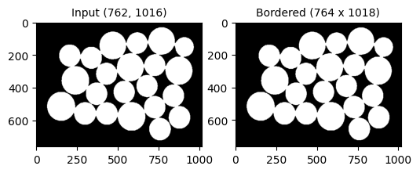
    


## Erosion

$ A \circ B = A \ominus B$

dimana:
- A adalah Gambar
- B adalah Kernel


```python
def erosion(img, size, times, show=False):
    import math
    import numpy as np
    import matplotlib.pyplot as plt
    
    kernel = np.ones((size, size))
    center = int(math.ceil(size/2))
    # kernel[center,:] = 1
    # kernel[:,center] = 1
    bordered = cv.copyMakeBorder(img, center, center, center, center, cv.BORDER_CONSTANT, None, 1)
    result = bordered.copy()
    counter = 1
    start = center
    left = start-1
    right = start
    num_plots = times+1

    if show:
        plt.figure(figsize=(10,2))
        plt.suptitle('Erosion: '+str(size)+'x'+str(size)+' Kernel', y=1, fontsize=18)
        plt.subplot(1, num_plots, counter)
        counter += 1
        plt.title('Input')
        plt.imshow(bordered, cmap='gray')
    
    for t in range(times):
        for i in range(start, bordered.shape[0]-center):
            for j in range(start, bordered.shape[1]-center):
                result[i,j] = np.min(bordered[i-left:i+start, j-left:j+right]*kernel)
        if show:
            plt.subplot(1, num_plots, counter)
            plt.title(str((counter))+'X')
            plt.imshow(result, cmap='gray')
            counter += 1
        bordered = result.copy()
    return result
```

### Erosion Using 3x3 Kernel


```python
result = erosion(img,3,5, True)
```


    
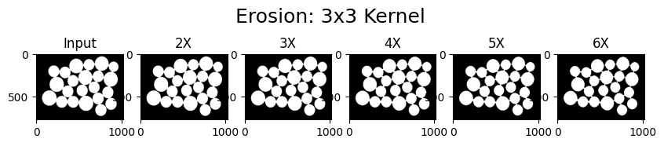
    


### Erosion Using 5x5 Kernel


```python
result = erosion(img,5,5, True)
```


    
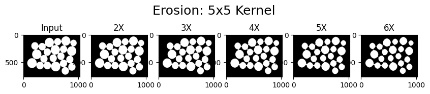
    


### Erosion Using 7x7 Kernel


```python
result = erosion(img,7,5,True)
```

    (762, 1016)


    
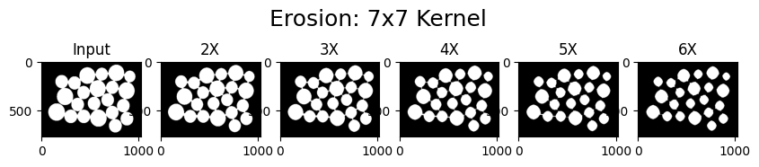
    


### Erosion Using 9x9 Kernel


```python
result = erosion(img,9,5,True)
```


    
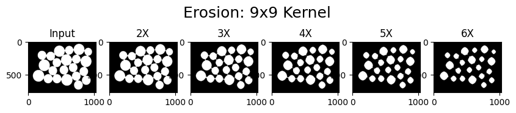
    


## Dilation

$ A \bullet B = A \oplus B$

dimana:
- A adalah Gambar
- B adalah Kernel


```python
def dilation(img, size, times, show=False):
    import math
    import numpy as np
    import matplotlib.pyplot as plt
    
    kernel = np.ones((size, size))
    center = int(math.ceil(size/2))
    # kernel[center,:] = 1
    # kernel[:,center] = 1
    bordered = cv.copyMakeBorder(img, center, center, center, center, cv.BORDER_CONSTANT, None, 1)
    result = bordered.copy()
    counter = 1
    start = center
    left = start-1
    right = start
    num_plots = times+1

    if show:
        plt.figure(figsize=(10,2))
        plt.suptitle('Erosion: '+str(size)+'x'+str(size)+' Kernel', y=1, fontsize=18)
        plt.subplot(1, num_plots, counter)
        counter += 1
        plt.title('Input')
        plt.imshow(bordered, cmap='gray')
    
    for t in range(times):
        for i in range(start, bordered.shape[0]-center):
            for j in range(start, bordered.shape[1]-center):
                result[i,j] = np.max(bordered[i-left:i+start, j-left:j+right]*kernel)
        if show:
            plt.subplot(1, num_plots, counter)
            plt.title(str((counter))+'X')
            plt.imshow(result, cmap='gray')
            counter += 1
        bordered = result.copy()
    return result
```

### Dilation 3x3 Kernel


```python
result = dilation(img,3,5,True)
```


    
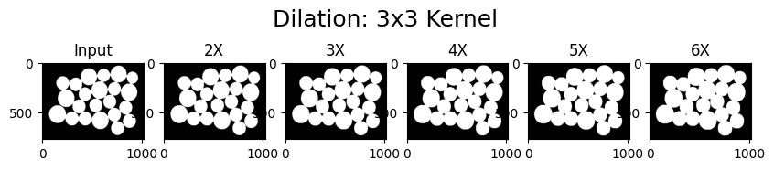
    


### Dilation 5x5 Kernel


```python
result = dilation(img,5,5,True)
```


    
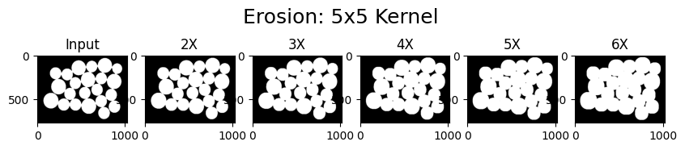
    


### Dilation 7x7 Kernel


```python
result = dilation(img,7,5,True)
```


    

    


### Dilation 9x9 Kernel


```python
result = dilation(img,9,5,True)
```


    
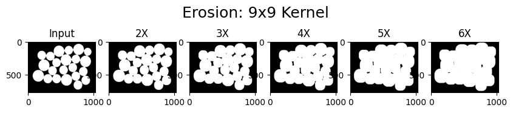
    


# Opening

$A \circ B = (A \ominus B)\oplus B$

dimana,
- A adalah Gambar
- B adalah Kernel
- $\ominus$ merupakan proses **erosion**
- $\oplus$ merupakan proses **dilation**

Sehingga tahapan pada proses Opening adalah:
1. Menerapkan proses Erosion pada gambar
2. Menerapkan proses Dilation pada output dari tahap pertama 


```python
img = cv.imread('sample_opening.png')
img = cv.cvtColor(img, cv.COLOR_BGR2GRAY)
plt.imshow(img, cmap='gray')
```


    <matplotlib.image.AxesImage at 0x11e5fc490>


    
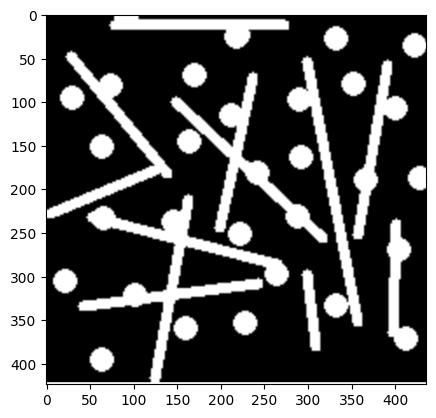
    


```python
def opening(img, times):
    plt.suptitle('Opening')
    result = img
    counter = 1
    end = times+1
    plt.subplot(3,5,counter)
    plt.title('Input')
    plt.imshow(result, cmap='gray')
    counter += 1
    for i in range(1, end):
        result = erosion(result, 13, 1)
        # plt.subplot(1,end,counter)
        # plt.title('Erosion')
        # plt.imshow(result, cmap='gray')
        # counter += 1

        result = dilation(result, 13, 1)
        plt.subplot(3,5,counter)
        plt.title('Loop-'+str(i))
        plt.imshow(result, cmap='gray')
        counter += 1

    return result
```


```python
opening(img,14)
```


    array([[1, 1, 1, ..., 1, 1, 1],
           [1, 1, 1, ..., 1, 1, 1],
           [1, 1, 1, ..., 1, 1, 1],
           ...,
           [1, 1, 1, ..., 1, 1, 1],
           [1, 1, 1, ..., 1, 1, 1],
           [1, 1, 1, ..., 1, 1, 1]], dtype=uint8)


    
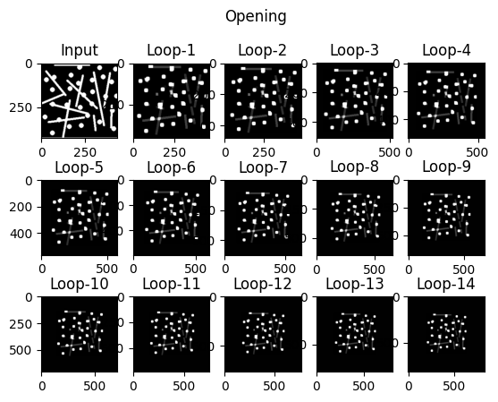
    


# Closing

$A \circ B = (A \oplus B)\ominus B$

dimana,
- A adalah Gambar
- B adalah Kernel
- $\ominus$ merupakan proses **erosion**
- $\oplus$ merupakan proses **dilation**

Sehingga tahapan pada proses Opening adalah:
1. Menerapkan proses Dilation pada gambar
2. Menerapkan proses Erosion pada output dari tahap pertama 


```python
def closing(img, times):
    plt.suptitle('Closing')
    result = img
    counter = 1
    end = times+1
    plt.subplot(3,5,counter)
    plt.title('Input')
    plt.imshow(result, cmap='gray')
    counter += 1
    for i in range(1, end):
        result = dilation(result, 5, 2)
        # plt.subplot(times,3,counter)
        # plt.title('Dilation')
        # plt.imshow(result, cmap='gray')
        # counter += 1

        result = erosion(result, 5, 3)
        plt.subplot(3,5,counter)
        plt.title('Loop-'+str(i))
        plt.imshow(result, cmap='gray')
        counter += 1

    return result
```


```python
img = cv.imread('sample_closing.png')
img = cv.cvtColor(img, cv.COLOR_BGR2GRAY)
closing(img, 4)
```


    array([[1, 1, 1, ..., 1, 1, 1],
           [1, 1, 1, ..., 1, 1, 1],
           [1, 1, 1, ..., 1, 1, 1],
           ...,
           [1, 1, 1, ..., 1, 1, 1],
           [1, 1, 1, ..., 1, 1, 1],
           [1, 1, 1, ..., 1, 1, 1]], dtype=uint8)


    
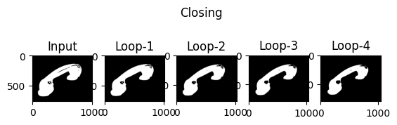
    


```python

```
